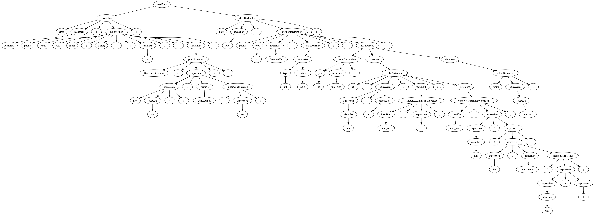

# Extended MiniJava Compiler

## Overview
This script serves as a compiler for MiniJava programs. It performs lexical, syntactical, and semantic analysis before generating Three-Address Code (TAC) for the input Java program. Additionally, it visualizes the parse tree.

## Features
- **Lexical Analysis**: Tokenizes the input Java file using ANTLR.
- **Syntax Parsing**: Builds a parse tree from the tokenized input.
- **Semantic Analysis**: Constructs a symbol table and performs type checking.
- **Code Generation**: Produces Three-Address Code (TAC) for valid MiniJava programs.
- **Visualization**: Generates a graphical representation of the parse tree.

## Parse Tree Visualization
This image is a sample parse tree for the file Factorial.java:


## Sample Program Output  

### Printing the Symbol Table:
```
+-------------------------------+---------------------+----------------------------+
|             ID                |         TYPE        |        SCOPE/RECORD        |
+-------------------------------+---------------------+----------------------------+
| Factorial                     | Factorial           | ClassRecord                |
+-------------------------------+---------------------+----------------------------+
| Fac                           | Fac                 | ClassRecord                |
+-------------------------------+---------------------+----------------------------+
| Factorial.main                | None                | MethodRecord               |
+-------------------------------+---------------------+----------------------------+
| Fac.ComputeFac                | int                 | MethodRecord               |
+-------------------------------+---------------------+----------------------------+
| num                           | int                 | Record                     |
+-------------------------------+---------------------+----------------------------+
| num_aux                       | int                 | Record                     |
+-------------------------------+---------------------+----------------------------+
```
### PRINTING Three Address Codes

```
METHOD Factorial.main

0  push param 10
1  t1 = lcall Fac.ComputeFac, 1
2  pop param 8
3  push param t1
4  lcall print, 1
5  return None

METHOD Fac.ComputeFac

0  t0 = (num < 1)
1  if not t0 goto L4
2  num_aux = 1
3  goto L11
4  label L4:
5  t5 = num - 1
6  push param t5
7  t7 = lcall Fac.ComputeFac, 1
8  pop param 8
9  t9 = num * t7
10  num_aux = t9
11  label L11:
12  return num_aux
```

## Prerequisites
### Install Dependencies
Ensure you have Python (>=3.6) installed along with the required dependencies:
```sh
pip install -r requirements.txt
```

### Install Graphviz (For Parse Tree Visualization)
- **Windows**: Download and install from [Graphviz Official Site](https://graphviz.gitlab.io/download/). Add the `bin` directory to system PATH.
- **Linux (Debian/Ubuntu)**:
  ```sh
  sudo apt install graphviz
  ```
- **Mac (Homebrew)**:
  ```sh
  brew install graphviz
  ```

## Usage
To run the script, use the following command:
```sh
python main.py <path_to_java_file>
```
Example:
```sh
python main.py examples/BinarySearch.java
```
If no file is provided, the default example (`examples/BinarySearch.java`) is used.

## Project Structure
```
MiniJavaCompiler/
│── .gitignore                # Ignore virtual environments, compiled files, etc.
│── README.md                 # Project documentation
│── requirements.txt          # List of dependencies
│── main.py                   # Entry point of the compiler
│
├───code_generator/           # Code generation module
│   ├── __init__.py
│   ├── controller.py         # Handles code generation (CodeGenVisitor)
│   ├── models.py             # Data models for code generation
│
├───examples/                 # Sample MiniJava programs & visual outputs
│   ├── BinarySearch.java
│   ├── BinarySearch.png
│   ├── BinaryTree.java
│   ├── BubbleSort.java
│   ├── Factorial.java
│   ├── LinearSearch.java
│   ├── LinkedList.java
│   ├── QuickSort.java
│   ├── Test.java
│
├───grammar/                  # ANTLR grammar files
│   ├── MiniJavaGrammar.g4
│
├───parser/                   # Generated ANTLR parser and lexer files
│   ├── MiniJavaGrammar.interp
│   ├── MiniJavaGrammar.tokens
│   ├── MiniJavaGrammarLexer.interp
│   ├── MiniJavaGrammarLexer.py
│   ├── MiniJavaGrammarLexer.tokens
│   ├── MiniJavaGrammarParser.py
│   ├── MiniJavaGrammarVisitor.py
│
├───semantic_analysis/        # Semantic analysis module
│   ├── __init__.py
│   ├── controller.py         # Handles semantic checks
│   ├── models.py             # Symbol table and type definitions
│
└───visual/                   # Visualization tools for parse trees
    ├── __init__.py
    ├── visualizer.py         # Parse tree visualizer

```

## Explanation of Components
1. **Lexical Analysis**: Uses `MiniJavaGrammarLexer` to tokenize the input file.
2. **Parsing**: `MiniJavaGrammarParser` generates a parse tree.
3. **Symbol Table Construction**: `SymbolTableVisitor` builds a symbol table.
4. **Type Checking**: `TypeCheckVisitor` ensures type correctness.
5. **Code Generation**: `CodeGenVisitor` produces TAC.
6. **Visualization**: `Visualizer` draws the parse tree using Graphviz.

## Author
Mahdi Shahmoradi

